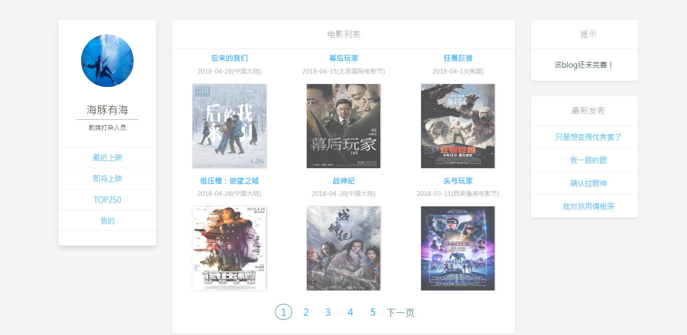

# vue-blog（如果对你有帮助点右上角star，谢谢啦）
## 技术栈
用到vue2 + vue-router + vuex + axios+ sass+flex
api是豆瓣电影，由于页面不是很多，vuex用的不多，关键掌握怎么实现就好了

## 参与开发
<br>
更多项目请关注 https://github.com/fanfan1993
<br>

> blog

## Build Setup

``` bash
# install dependencies
npm install

# serve with hot reload at localhost:8080
npm run dev

# build for production with minification
npm run build

# build for production and view the bundle analyzer report
npm run build --report


For a detailed explanation on how things work, check out the [guide](http://vuejs-templates.github.io/webpack/) and [docs for vue-loader](http://vuejs.github.io/vue-loader).


### 页面效果
##### 页面显示

